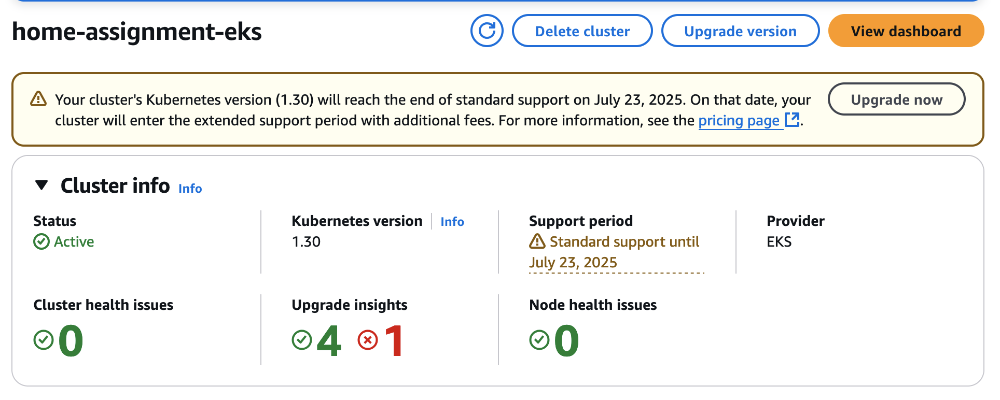
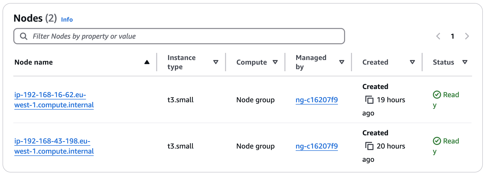
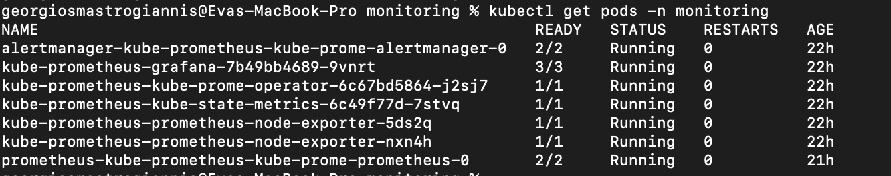
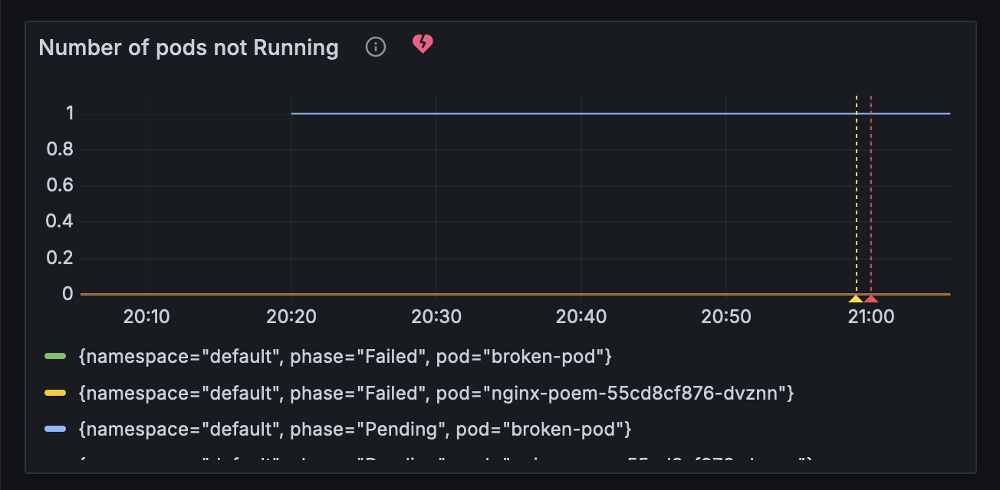
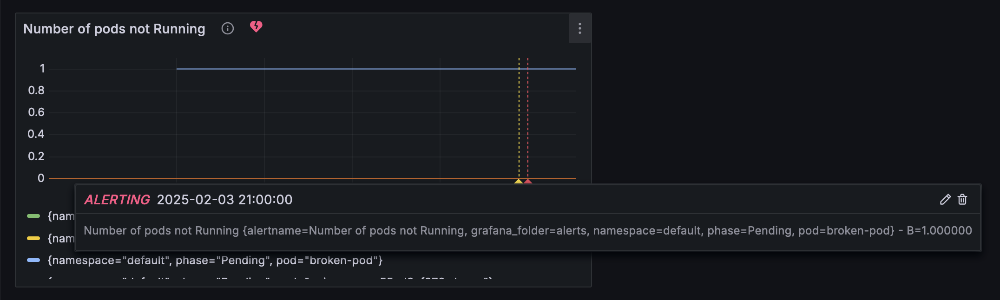

# Jamf DevOps Home Assignment
### by Georgios Mastrogiannis

## Overview
This repository contains my solution to the **Jamf DevOps Home Assignment**, where I:
- 🚀 **Deployed** a Kubernetes cluster on **AWS EKS**
- 🌐 **Deployed** an app on the Kubernetes cluster
- 📊 **Configured monitoring** with **Prometheus & Grafana**
- 🔔 **Created a dashboard** in Grafana with **alerting**

---

## Infrastructure Setup
- **Decision:** Run on **AWS EKS** instead of **local Minikube/Katacoda** for real-world experience.
- **Tools Used:** Terraform, AWS CLI, eksctl, Helm, kubectl.

✅ **AWS CLI Configuration:**  
`aws configure --profile aws-personal`  

✅ **Creating the EKS Cluster with eksctl:**  
`eksctl create cluster --name home-assignment-eks --region eu-west-1 --nodes 1 --node-type t3.small --profile aws-personal`  



---

## Deploy an App
💡 **Deploy an Nginx pod serving a poem as a simple web page.**  
✅ **Applied manifests:**
```
kubectl apply -f poem-configmap.yaml
kubectl apply -f nginx-deployment.yaml
kubectl apply -f nginx-service.yaml
```
[Nginx poem service](http://a0f353cb55ef546d8aafafb70a2fe534-1452479694.eu-west-1.elb.amazonaws.com/)

## Setup Monitoring
✅ - **Installed Kube-Prometheus-Stack via Helm.**
```
helm repo add prometheus-community https://prometheus-community.github.io/helm-charts
helm repo update
helm install kube-prometheus prometheus-community/kube-prometheus-stack --namespace monitoring --create-namespace
```
💡 **Problem:** Some pods stuck in **Pending** → **Not enough nodes!**

✅ **Scale up nodes:**
```eksctl scale nodegroup --cluster home-assignment-eks --name ng-c16207f9 --nodes 2 --nodes-min 1 --nodes-max 3 --region eu-west-1 --profile aws-personal```





✅ **Grafana Public Access**
```helm upgrade --install kube-prometheus prometheus-community/kube-prometheus-stack --namespace monitoring --set grafana.service.type=LoadBalancer```

[Grafana link](http://af6630fcfd8964c84b1b3503bcbeacdb-549446600.eu-west-1.elb.amazonaws.com/?orgId=1&from=now-6h&to=now&timezone=browser)

## Configure Dashboard and Alert
✅ - Tried creating a custom SLO for HTTP Success Rate.

✅ - Faced challenges with metrics availability.

✅ - Final Decision: Used existing Kubernetes pod health metrics for alerting and visualization
Prometheus Query used for Pod Health Alert

```
sum by (namespace, pod) (
  max by (namespace, pod) (
    kube_pod_status_phase{phase!="Running"}
  )
) > 0
```




## Challenges
- **Terraform Hurdles:**  
  Started building the infra (**network, IAM, EKS**) using **Terraform**, but faced persistent issues during **node group creation**. Nodes failed to join the cluster, even after trying both self-managed and AWS-managed node groups.  
  - **Solution:** Switched to **eksctl**, which automated the setup and resolved the issues.  

- **SLO Visibility Issue:**  
  Created an SLO (Service Level Objective) but couldn't see the rule in Prometheus.  
  - **Possible Causes:** Incorrect labels or errors in the rule creation process.

- **Grafana Alerting Challenges:**  
  Attempted integrating alerts with **Email, Telegram, and AWS SNS**.  
  - **Email:** Needed SMTP setup, which wasn't configured.  
  - **Telegram:** Encountered HTTP 400 errors.  
  - **AWS SNS:** Didn't try yet, but it's a strong candidate for next steps.  

## Lessons Learned
- **Fail Fast:** If something isn’t working, pivot quickly and explore alternatives.  
- **Leverage Managed Services:** Using **eksctl** saved time by automating a complex process that Terraform struggled with.  
- **Observability Matters:** Deep understanding of Prometheus metrics and Grafana queries is crucial for effective troubleshooting in cloud environments.